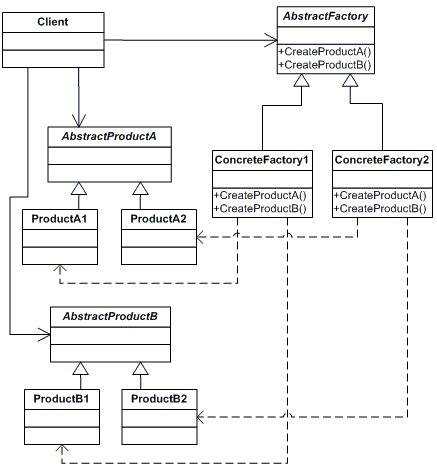

## Abstract Factory Pattern
### Intent
1. Provide an interface for creating families of related or dependent objects without specifying concrete classes

2. Objects can be grouped into a hierarchy that encapsulates distinct platforms consisting of a suite of related objects

3. Calling code works with abstract interfaces and classes and does not need to know the exact types of he objects created by the factory

### Definitions
1. Products - objects created by the factory

2. Platforms of products - a set of products that can be created in one go. Within a platform, the products interoperate with each other in a specific way

### Benefits
1. Remove if-then-else blocks from construction code
2. Easy to exchange platforms

### UML


Platforms:
- ConcreteFactory1 - to create ProductA1 and ProductB1
- ConcreteFactory2 - to create ProductA2 and ProductB2

Steps:
1. Client call the AbstractFactory to create any productsthe
2. AbstractFactory determines which platform to use and instantiates the correct platform factory
3. AbstractFactory asks that factory to create the actual products

### Checklist
1. Make sure you have a large product family with lots of interdependencies between products, your code contains lots of switch and if statements
2. Create a matrix of platforms versus products
3. Make sure you have at least two abstract products and platforms
4. Create abstract factory will create methods for each product type
5. Create derived factories for each platform, implement create methods
6. Make sure the client doesn't use new, only uses abstract types

### Example
An application that models food chains on different continents around the world

| Abstract Products \ Platforms | Africa | Australia |
| --- | --- | --- |
| Carnivore | Lion | Dingo |
| Herbivore | Zebra | Kangaroo|

#### Class needed
1. Factory - a continent factory that will either create an Africa factory or an Australia factory
2. Client - ecosystem to simulate one carnivore eating one herbivore in one iteration

| Pattern class | Example classes |
| --- | --- |
| AbstractFactory | ContinentFactory |
| ConcreteFactory | AfricaFactory, AustraliaFactory |
| AbstractProduct | Herbivore, Carnivore |
| Product | Lion, Dingo, Zebra, Kangaroo |
| Client | Ecosystem|

#### C# code
The abstract factory class
```csharp
namespace FoodchainExample
{
  abstract class ContinentFactory
  {
    public abstract Carnivore CreateCarnivore();
    public abstract Herbivore CreateHerbivore();
  }
}
```
The concrete factory class for Africa
```csharp
namespace FoodchainExample
{
  class AfricaFactory : ContinentFactory
  {
    public override Herbivore CreateHerbivore()
    {
      return new Zebra();
    }
    public override Carnivore CreateCarnivore()
    {
      return new Lion();
    }
  }
}
```
The concrete factory class for Australia
```csharp
namespace FoodchainExample
{
  class AustraliaFactory : ContinentFactory
  {
    public override Herbivore CreateHerbivore()
    {
      return new Kangaroo();
    }
    public override Carnivore CreateCarnivore()
    {
      return new Dingo();
    }
  }
}
```
The abstract herbivore class
```csharp
namespace FoodchainExample
{
  abstract class Herbivore
  {
  }
}
```
The abstract carnivore class with an "eat" method
```csharp
namespace FoodchainExample
{
  abstract class Carnivore
  {
    public abstract void Eat(Herbivore herbivore);
  }
}
```
The concrete product class for Lion
```csharp
namespace FoodchainExample
{
  class Lion : Carnivore
  {
    public override void Eat(Herbivore herbivore)
    {
      Console.WriteLine("{0} eats {1}", this.GetType().Name, herbivore);
    }
  }
}
```
Zebra
```csharp
namespace FoodchainExample
{
  class Zebra : Herbivore
  {
  }
}
```
Dingo
```csharp
namespace FoodchainExample
{
  class Dingo : Carnivore
  {
    public override void Eat(Herbivore herbivore)
    {
      Console.WriteLine("{0} eats {1}", this.GetType().Name, herbivore);
    }
  }
}
```
Kangaroo
```csharp
namespace FoodchainExample
{
  class Kangaroo : Carnivore
  {
  }
}
```
Ecosystem
```csharp
namespace FoodchainExample
{
  class Ecosystem
  {
    private Herbivore _herbivore;
    private Carnivore _carnivore;

    public Ecosystem(ContinentFactory factory)
    {
      _herbivore = factory.CreateHerbivore();
      _carnivore = factory.CreateCarnivore();
    }

    // Let the ecosystem run
    public void Run()
    {
      _carnivore.Eat(_herbivore);
    }
  }
}
```
Main program
```csharp
namespace FoodchainExample
{
  public static void Main(string[] args)
  {
    // simulate ecosystem in Africa
    ContinentFacory factory1 = new AfricaFactory();
    Ecosystem ecosystem1 = new Ecosystem(factory1);
    ecosystem1.Run();

    // simulate ecosystem in Australia
    ContinentFactory factory2 = new AustraliaFactory();
    Ecosystem ecosystem2 = new Ecosystem(factory2);
    ecosystem2.Run();
  }
}
```
