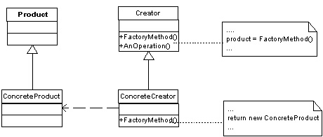

## Builder Pattern
### Intent
1. Define an interface for creating objects, but let subclasses decide which class to instantiate

2. Decouple requesting objects from creating objects

3. Calling code doesn't need to know what types of objects are created

The factory method pattern sets up an abstract object constructor that can be overridden by the subclasses, which gives the subclasses full control over object creation.

### Definitions


### Benefits
1. Factory subclass has full control over the creation process: it can return the requested type or a subclass

2. Factory subclass can return existing instance

3. Easy to change the type of products

### UML

The factory methods are in another class called Creator. In this way, the client has a limited control over what product to generate by specifying the concrete creator class.

An alternative way is to put the factory methods as static methods in the Product class. These methods evaluate its arguments and decides what kind of product subclasses to return. In this way, the client has 0 control.


### Checklist
1. Make sure you need control over how your code creates new objects

2. Create a concrete factory class for each type of object

3. Create an abstract factory that unifies all concrete factories

4. Make sure the client does not use new anywhere and only uses the factory method to create new instances

### Example
Toy factory example

Process is always the same:
1. Prepare plastic powder
2. Select the correct mold
3. Inject the powder
4. Heat the mold
5. Paint the toy

#### Class needed
| Pattern class | Example class |
| --- | --- |
| Product | Toy |
| ConcreteProduct | Firetruck<br/>Duck<br/>Superman |
| Creator | ToyCreator |
| ConcreteCreator | FiretruckCreator<br/>DuckCreator<br/>SupermanCreator |

#### C# code
The toy super class
```csharp
using System;
using System.Drawing;

namespace ToyFactoryExample
{
  abstract class Toy
  {
    public abstract int GetPowderQuantity();

    public abstract TimeSpan GetHeatingTime();

    public abstract Color GetColor();
  }
}
```
The duck class
```csharp
using System;
using System.Drawing;

namespace ToyFactoryExample
{
  class Duck : Toy
  {
    public override int GetPowderQuantity()
    {
      return 20;
    }

    public override TimeSpan GetHeatingTime()
    {
      return TimeSpan.FromMinutes(1);
    }

    public override Color GetColor()
    {
      return Color.Yellow;
    }
  }
}
```
The firetruck class
```csharp
using System;
using System.Drawing;

namespace ToyFactoryExample
{
  class Firetruck : Toy
  {
    public override int GetPowderQuantity()
    {
      return 40;
    }

    public override TimeSpan GetHeatingTime()
    {
      return TimeSpan.FromMinutes(3);
    }

    public override Color GetColor()
    {
      return Color.Red;
    }
  }
}
```
The superman class
```csharp
using System;
using System.Drawing;

namespace ToyFactoryExample
{
  class Superman : Toy
  {
    public override int GetPowderQuantity()
    {
      return 15;
    }

    public override TimeSpan GetHeatingTime()
    {
      return TimeSpan.FromMinutes(2);
    }

    public override Color GetColor()
    {
      return Color.Blue;
    }
  }
}
```
The abstract toy creator class that specify the toy creation process
```csharp
namespace ToyFactoryExample
{
  abstract class ToyCreator
  {
    protected abstract Toy CreateToy();

    // Toy creation process
    public void MakeToy()
    {
      Toy toy = CreateToy();
      int grams = toy.GetPowderQuantity();
      PreparePowder(toy);
      SelectMold(toy);
      InjectPowder(grams);
      Timespan heatingTime = toy.GetHeatingTime();
      HeatMold(heatingTime);
      ExtractToy();
      Color color = toy.GetColor();
      PaintToy(color);
    }

    #region Toy construction methods
    private void PreparePowder(int grams)
    {
    }

    private void SelectMold(Toy toy)
    {
    }

    private void InjectPowder(int grams)
    {

    }

    private void HeatMold(TimeSpan duration)
    {
    }

    private void ExtractToy()
    {

    }

    private void PaintToy(Color color)
    {
    }

    #endregion
  }
}
```
The duck creator class
```csharp
namespace ToyFactoryExample
{
  class DuckCreator : ToyCreator
  {
    protected override Toy CreateToy()
    {
      return new Duck();
    }
  }
}
```
The firetruck creator class
```csharp
namespace ToyFactoryExample
{
  class FiretruckCreator : ToyCreator
  {
    protected override Toy CreateToy()
    {
      return new Firetruck();
    }
  }
}
```
The superman creator class
```csharp
namespace ToyFactoryExample
{
  class SupermanCreator : ToyCreator
  {
    protected override Toy CreateToy()
    {
      return new Superman();
    }
  }
}
```
Main program
```csharp
namespace ToyFactoryExample
{
  class MainClass
  {
    public static void Main(string[] args)
    {
      ToyCreator creator = null;

      // Create a firetruck
      creator = new FiretruckCreator();
      creator.MakeToy();

      // Create a superman
      creator = new SupermanCreator();
      creator.MakeToy();

      // Create a duck
      creator = new DuckCreator();
      creator.MakeToy()
    }
  }
}
```
